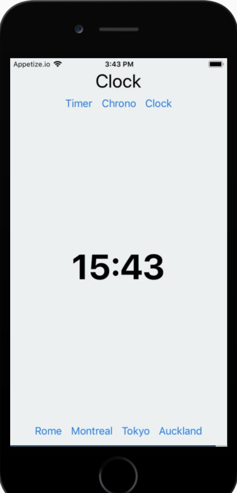

# It's time!

It's time to get started building real React Native applications!

In this lab, we'll build up on your already extensive knowledge of counters. We will define a Timer/Chrono/Clock app with the following functionality:
- The current selected functionality type is shown as the title of the app
- Below it, buttons are displayed to switch the functionality type (Timer, Chrono, Clock), aligned in a row.
- Then, the current value (e.g. time left, elapsed time, time) is displayed in a large font.
- In timer mode, the time left is displayed in minutes and seconds, and counts down.
- In chrono mode, the elapsed time is displayed in minutes, seconds, and tenths of seconds, counting up.
- In time mode, the current time is diplayed in hours and minutes.

In addition, each mode has additional functionality. These can be triggered by additional row(s) of buttons below the displayed value:
- The timer can be started, paused, reset, and stop. The value can be increased or decreased in 1 and 5 minutes increments. 
- The chrono can be started, paused, and reset.
- The clock can display the time in 4 selected time zones of your choice. 

To give you a rough idea, the application can look like this:


If you have extra time, you can further look into the following:
- For the timer, change the background color when it is closer to zero. If the time left is 20% of the elapsed time, change it to yellow. If 10%, orange. If 5%, red. When the count has elapsed, the background should blink: 1 second red, 1 second white, until the reset or stop button are pressed.
- The clock supports a pop-up menu style component or a text input to select the time zone.
- The chrono supports the "lap" functionality.

Note: the following code snippets shows an example of how to display the current date in the UK timezone:

```javascript
const options = {timeZone: 'Europe/London'}
const formatter = new Intl.DateTimeFormat([], options)
formatter.format(new Date())
```

Find more information at: [https://developer.mozilla.org/en-US/docs/Web/JavaScript/Reference/Global_Objects/DateTimeFormat].